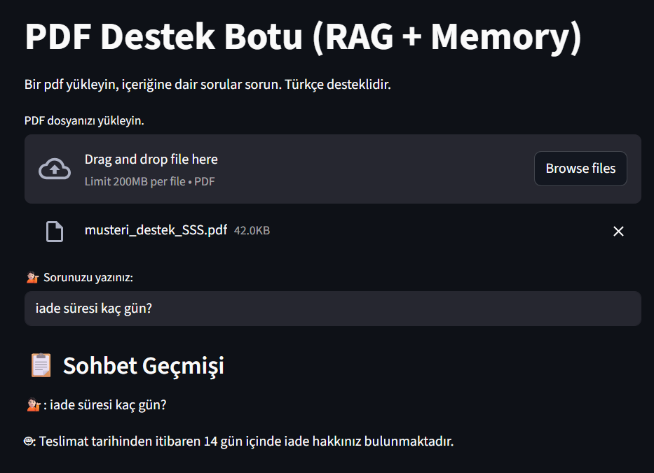

# 📄 Akıllı Müşteri Destek Sistemi - PDF Tabanlı RAG Chatbot

Bu proje, müşteri destek süreçlerini otomatikleştirmek için oluşturulmuş bir RAG (Retrieval-Augmented Generation) mimarisine sahip PDF tabanlı soru-cevap sistemidir. Amaç, sıkça sorulan müşteri sorularına (SSS) yapay zeka destekli akıllı yanıtlar vermektir.

---

## 🚀 Kullanılan Teknolojiler

| Teknoloji                         | Açıklama                                                                 |
|----------------------------------|--------------------------------------------------------------------------|
| **Langchain**                    | RAG mimarisini kurmak ve bileşenleri birbirine bağlamak için             |
| **Faiss**                        | Vektör veri tabanı, embedding'leri hızlı arama için depolamak üzere      |
| **Google Gemini (LLM)**          | Soru-cevap ve sohbet için güçlü dil modeli (ChatGoogleGenerativeAI)     |
| **HuggingFace Embeddings**       | Metni vektörlere dönüştürmek için çok dilli model                        |
| **Streamlit**                    | Web tabanlı interaktif kullanıcı arayüzü için                            |
| **python-dotenv**                | API anahtarlarını `.env` dosyasından güvenli şekilde çekmek için         |

---

## 📷 Uygulama Arayüzü
Aşağıda uygulamanın çalışır hâline ait bir ekran görüntüsü yer almaktadır:




## 🧠 Proje Planı ve Çalışma Akışı

1. **PDF Hazırlığı:**  
   - Sıkça sorulan müşteri sorularını içeren bir PDF dosyası hazırlanır.

2. **Kullanıcı Yüklemesi:**  
   - Kullanıcı, PDF dosyasını Streamlit arayüzünden yükler.

3. **İşleme & Embedding:**  
   - PDF içeriği küçük parçalara bölünür.  
   - Her parça `HuggingFace` ile vektörleştirilir (embedding).  

4. **Vektör Veritabanı (FAISS):**  
   - Vektörler `faiss` veritabanında saklanır.  

5. **Soru-Cevap Akışı:**  
   - Kullanıcı bir soru sorar.  
   - Sistem, vektör veritabanında en benzer 3 parçayı getirir (`k=3`).  
   - `Google Gemini` modeli, bu içerik ve konuşma geçmişi bağlamında Türkçe cevap üretir.

6. **Hafıza (Memory):**  
   - Sohbet geçmişi saklanır ve bağlamlı cevaplar için sonraki yanıtlarda kullanılır.

---

## ⚙️ Kurulum & Çalıştırma

### 1. Proje klasörüne geç:
 
  ```cd basic-gemini-rag-pdfchatbot```

### 2. Gerekli kütüphaneleri yükle:

   ```pip install -r requirements.txt```

### 3. 🔐.env Dosyası Ayarları

   ```GEMINI_API_KEY=your_api_key_here```

### 4. 🖥️ Arayüzü Başlatma (Streamlit)
 - Web arayüzünü başlatmak için aşağıdaki komutu kullan:

   ```streamlit run streamlit_app.py```

---

### 📌 Notlar
 - requirements.txt içinde proje için gerekli tüm kütüphaneler ve versiyonları yer almaktadır.

 - Eğer .venv dosyasını taşıyamadıysan, bu dosyadaki bağımlılıkları ```pip freeze > requirements.txt``` komutu ile tekrar oluşturabilirsin.

 - sss_vectordb klasörü, embedding veritabanını içerir. Mevcut dosyalarla birlikte çalışmak için bu klasörü silmeden çalıştır.

---


